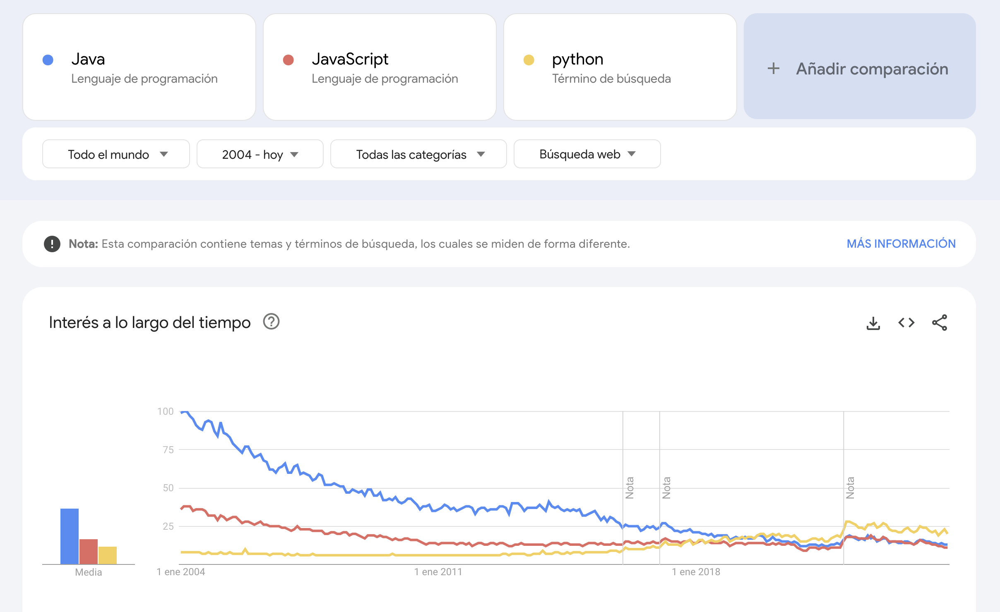

# Intro a Python

Python es un lenguaje de programación interpretado, de alto nivel y de propósito general, conocido por su simplicidad y legibilidad, lo que lo hace ideal tanto para principiantes como para programadores experimentados. Creado por Guido van Rossum en 1991, Python se ha convertido en uno de los lenguajes más populares y versátiles del mundo, con aplicaciones que van desde el desarrollo web y la automatización hasta la ciencia de datos y la inteligencia artificial. https://www.python.org/ Instalación: https://www.python.org/downloads/windows/

Utilizar una guía de estilo en Python, como la popular PEP 8, es fundamental para asegurar que el código sea consistente, legible y mantenible. Una guía de estilo proporciona convenciones y recomendaciones sobre cómo escribir el código de forma estandarizada. Guias de estilo: https://peps.python.org/pep-0020/ (El Zen del Python)

## Material 

Curso de introducción (4 horas): https://learn.microsoft.com/es-es/training/paths/beginner-python/

Curso avanzado (3 días): https://ti.to/saturdaysai/python-4-ai-program

Katas: https://www.codewars.com/

Ejercicios: https://www.w3schools.com/python/default.asp

## TODO

Archivo con ejemplo de code

Repasar lo que tengan en Google

Reto de hacer la clase como si fueran objetos

Proyecto de un contador

Hablar con Manuela
